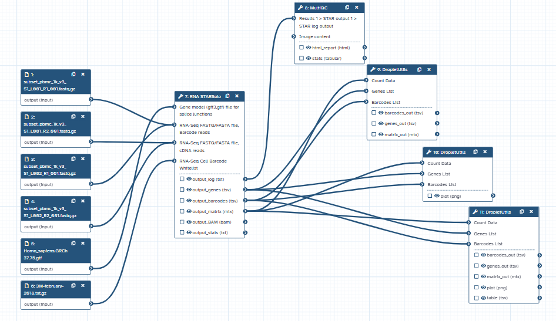
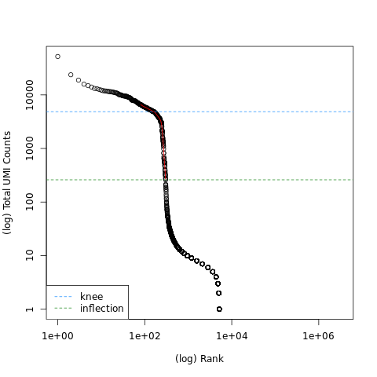
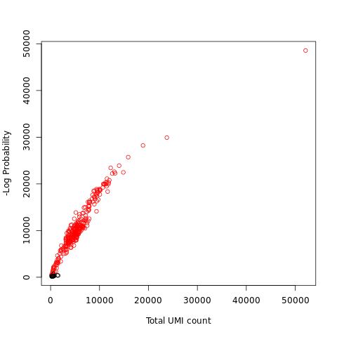

# Part 1: Pre-processing of 10X Single-Cell RNA Datasets (Galaxy)

**File:** `Documentation_Galaxy.md`

**Tutorial source:** [Galaxy Training Network — Pre-processing of 10X scRNA Datasets](https://training.galaxyproject.org/training-material/topics/single-cell/tutorials/scrna-preprocessing-tenx/tutorial.html)

---

## Overview

The goal of this tutorial is to take raw sequencing output from a 10X Chromium single-cell RNA-seq experiment and convert it into a clean, filtered gene expression matrix that is ready for downstream analysis. This is done entirely through the Galaxy platform (no coding required) using two tools in sequence: **STARsolo** for alignment and quantification, and **DropletUtils** for filtering empty droplets.

The pipeline answers a core challenge in scRNA-seq: raw data contains tens of thousands of "cell barcodes," most of which correspond to empty droplets rather than real cells. The preprocessing workflow identifies and retains only the barcodes that represent genuine, high-quality cells.



---

## Background Concepts

### What is 10X Chromium Data?

10X Genomics Chromium is a droplet-based microfluidic platform for single-cell RNA sequencing. Each cell is encapsulated in a droplet together with a gel bead containing:

- A **cell barcode** — a short DNA sequence unique to that droplet, used to tag all RNA reads from the same cell
- A **UMI (Unique Molecular Identifier)** — a random sequence attached to each RNA molecule to allow deduplication of PCR copies

The output of a 10X experiment is a set of FASTQ files with two main read types:
- **R1** — contains the cell barcode + UMI (first 28 bp)
- **R2** — contains the actual cDNA sequence (the gene-specific read)

In this tutorial, the dataset is **1k PBMCs from a Healthy Donor (v3 chemistry)** — 1,000 Peripheral Blood Mononuclear Cells (PBMCs) from a healthy donor. PBMCs are primary immune cells with relatively small amounts of RNA (~1 pg RNA/cell), making them a standard benchmark dataset. A subsampled version (~300 cells) was used for the tutorial.

### What is STARsolo?

STARsolo is an extension of the STAR aligner that natively handles single-cell data. It replaces Cell Ranger (10X's proprietary tool) and performs two tasks in one step:

1. **Alignment** — maps R2 cDNA reads to a reference genome (here, human GRCh37/hg19)
2. **Demultiplexing and quantification** — uses the cell barcode whitelist to assign each read to a cell, counts UMIs per gene per cell, and outputs a raw count matrix

The output is a **cell × gene count matrix** in 10X Market Exchange Format (MEX): three files — a sparse matrix, a barcode list, and a gene/feature list.

### What is DropletUtils?

DropletUtils is an R/Bioconductor package (available as a Galaxy tool) designed to distinguish real cells from empty droplets in the raw STARsolo output. Because droplet-based platforms inevitably capture some ambient RNA in empty droplets, the raw matrix contains many more "barcodes" than actual cells.

DropletUtils provides several filtering strategies:
- **emptyDrops** — statistically tests each barcode against the ambient RNA profile
- **barcodeRanks / knee-point detection** — ranks barcodes by total UMI count and identifies the inflection/knee point on the curve where the count drops sharply, separating real cells from empty droplets
- **Custom UMI threshold** — manually set a minimum UMI cutoff

### Key File Types

| File | Description |
|---|---|
| `matrix.mtx` | Sparse count matrix in MEX format. Rows = genes, columns = barcodes |
| `barcodes.tsv` | List of cell barcode sequences, one per column of the matrix |
| `features.tsv` / `genes.tsv` | List of genes/features, one per row of the matrix |
| `.bam` | Aligned reads file — stores every read mapped to the genome |
| Barcode rank plot | Diagnostic plot: log(UMI count) vs log(barcode rank), used to find the knee point |

These three files together (matrix + barcodes + features) form the standard input for downstream tools like Scanpy or Seurat.

---

## Implementation

### Input Data

All files were sourced from the [Zenodo repository (record 3457880)](https://zenodo.org/record/3457880):

**Subsampled 10X FASTQ files (2 lanes, R1 + R2 only — I1 not required by STARsolo):**
```
subset_pbmc_1k_v3_S1_L001_R1_001.fastq.gz
subset_pbmc_1k_v3_S1_L001_R2_001.fastq.gz
subset_pbmc_1k_v3_S1_L002_R1_001.fastq.gz
subset_pbmc_1k_v3_S1_L002_R2_001.fastq.gz
```

**Reference genome annotation:**
```
Homo_sapiens.GRCh37.75.gtf
```

**Cell barcode whitelist (10X v3 chemistry):**
```
3M-february-2018.txt.gz
```

### Step 1 — RNA STARsolo (Alignment & Quantification)

STARsolo was run with the subsampled FASTQ files, the GRCh37 genome, and the 10X v3 barcode whitelist. It produced 6 output files:

| Output | Description |
|---|---|
| Log | Run summary and parameter log |
| Feature Statistic Summaries | Per-barcode mapping statistics |
| Alignments (BAM) | All mapped reads with barcode/UMI tags |
| Matrix Gene Counts | Raw sparse count matrix (bundled MEX format) |
| Barcodes | Detected cell barcodes |
| Genes | Gene list |

**Key statistic from the Feature Statistic Summaries:** `yesCellBarcodes` reported **5,200 detected barcodes** at this stage — far more than the expected ~300 cells, because empty droplets have not yet been filtered. The `yessubWLmatch_UniqueFeature` metric had the highest value (reads unambiguously mapping to a single gene), which is the desired outcome. The `noNoFeature` count (reads mapping to the genome but not to any annotated gene) was relatively high, but this is expected behaviour even in the original non-subsampled datasets.

**MultiQC** was run on the STARsolo log to visualise mapping quality. The full report is available at [`qc_reports/multiqc_RNA_STARsolo_logs_html.html`](qc_reports/multiqc_RNA_STARsolo_logs_html.html).

### Step 2 — DropletUtils (Cell Filtering)

Three runs of DropletUtils were performed using increasing sophistication:

**Run 1 — Cell Ranger method (simple knee-point):**
Used the built-in Cell Ranger-style knee-point detection. Result: **272 high-quality cells** retained.

**Run 2 — Introspective method (barcode rank plot):**
Generated a barcode rank plot showing log(total UMI count) on the y-axis vs. log(barcode rank) on the x-axis. The knee and inflection points on the curve mark the boundary between cells (high RNA content) and empty droplets (low RNA content). This plot provides a visual confirmation of where to set the filtering threshold.



**Run 3 — Custom filtering:**
Applied a custom UMI lower-bound threshold informed by the rank plot. Result: **279 high-quality cells** retained — slightly more than Run 1, as the custom threshold was tuned to the data.



---

## Output Files

After the full pipeline, the key deliverables are:

**Raw STARsolo count matrix:**
- `data/RNA_STARSolo_count_matrix.mtx` — the unfiltered sparse matrix output directly from STARsolo, containing all 5,200 detected barcodes (including empty droplets)

**Filtered count matrix (MEX format, DropletUtils output):**
- `data/matrix.mtx` — sparse matrix of UMI counts; only barcodes passing the DropletUtils custom filter are retained
- `data/barcodes.tsv` — the 279 cell barcodes that passed filtering
- `data/genes.tsv` — the list of genes quantified

**Interpretation:** Each row in the matrix is a gene, each column is a cell, and each value is the number of UMI-deduplicated RNA molecules detected. The sparsity of this matrix is high (most entries are zero), which is normal for scRNA-seq data — most genes are not detected in most cells.

**Barcode rank plot:** The knee/inflection point visually confirms that the chosen threshold cleanly separates the two populations (cells vs. empty droplets). Barcodes to the left of the knee have high UMI counts and represent real cells; those to the right represent background noise from empty droplets.

This filtered matrix is the direct input for Part 2 (Scanpy analysis).

---

## Repository Structure

```
01_preprocessing_galaxy/
├── Documentation_Galaxy.md                              ← This file
├── Workflow.png                                         ← Galaxy workflow diagram
├── data/
│   ├── RNA_STARSolo_count_matrix.mtx                   ← Raw STARsolo count matrix (pre-filtering)
│   ├── matrix.mtx                                      ← Filtered sparse count matrix (DropletUtils output)
│   ├── barcodes.tsv                                     ← Filtered cell barcodes (279 cells)
│   └── genes.tsv                                        ← Gene list
├── logs/
│   ├── RNA_STARSolo_log.txt                             ← STARsolo run log
│   └── RNA_STARSolo_Barcode_Feature_Statistic_Summaries.txt  ← Per-barcode mapping statistics
└── qc_reports/
    ├── multiqc_RNA_STARsolo_logs_html.html              ← MultiQC report (mapping quality)
    ├── barcode_rank_plot.png                            ← DropletUtils knee/inflection plot
    └── Total_UMI_count_plot.png                         ← Total UMI distribution plot
```

---

## Tools Used

| Tool | Version / Source |
|---|---|
| Galaxy Platform | [usegalaxy.org](https://usegalaxy.org) |
| RNA STARsolo | Galaxy tool wrapper for STAR |
| DropletUtils | Galaxy tool wrapper (Bioconductor) |
| MultiQC | Quality control visualisation |

**Reference genome:** Homo sapiens GRCh37 (hg19), Ensembl release 75
